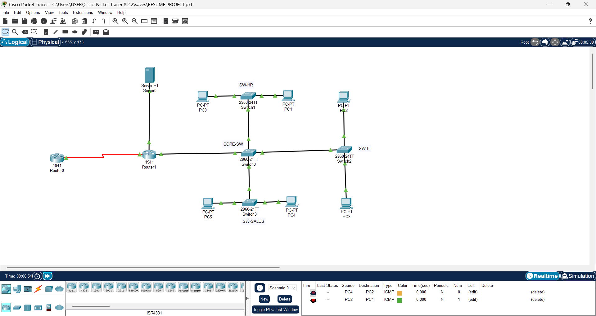
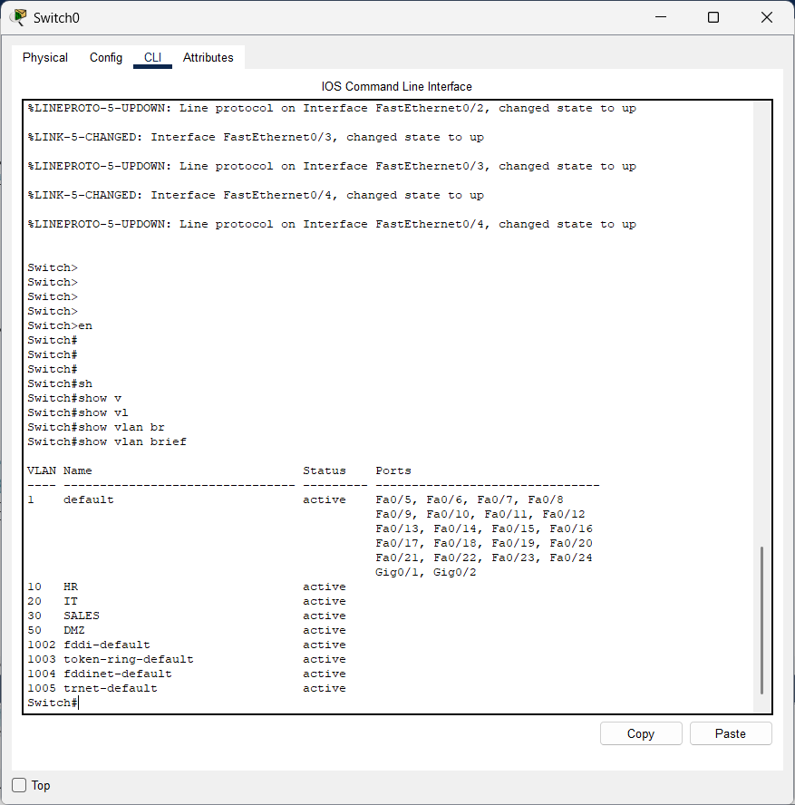
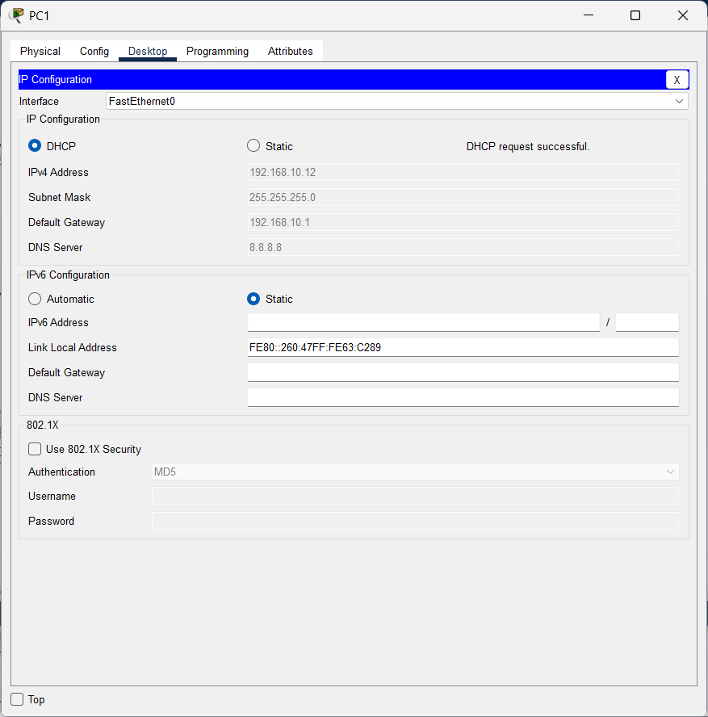

# Enterprise Network Design & Implementation

## 📌 Project Overview
This project demonstrates the design and implementation of a real-world enterprise network using Cisco Packet Tracer. The network follows a core–access hierarchical architecture and includes VLAN segmentation, dynamic routing, security controls, and a DMZ.

## 🏗️ Network Architecture
- Core–Access hierarchical design
- 1 Core Switch
- 3 Access Switches (HR, IT, Sales)
- Router-on-a-Stick for inter-VLAN routing

## ⚙️ Technologies Used
- VLANs & 802.1Q Trunking
- Inter-VLAN Routing
- OSPF (Dynamic Routing)
- DHCP
- NAT (PAT)
- Extended ACLs
- DMZ (Web & DNS Servers)

## 🔐 Security Implementation
- VLAN segmentation for isolation
- Extended ACLs to restrict inter-department traffic
- DMZ to isolate public-facing services

## 🧪 Validation
- End-to-end connectivity testing
- Routing verification
- Security rule validation

## 🧠 Skills Gained

### Networking Skills
- Enterprise network design (Core–Access architecture)
- VLAN creation and network segmentation
- Inter-VLAN routing (Router-on-a-Stick)
- Dynamic routing using OSPF
- IP addressing and subnetting
- DHCP configuration and troubleshooting
- NAT (PAT) configuration for internet access
- Extended ACLs for traffic filtering
- DMZ design and implementation

### Security Skills
- Network segmentation for security isolation
- Access control using extended ACLs
- Securing public-facing services using DMZ

## 📷 Screenshots

### Network Topology

### VLAN Configuration

### DHCP Testing

## 📁 Files Included

- [Enterprise Network Topology (.pkt)](enterprice%20network.pkt)

- [Core Switch Configuration](core-SW-config.txt)

- [HR Switch Configuration](HR-SW-config.txt)

- [IT Switch Configuration](IT-SW-config.txt)

- [Sales Switch Configuration](SALES-SW-config.txt)

- [Router 1 Configuration](router%201-config.txt)

- [Router 2 Configuration](router2-config.txt)
